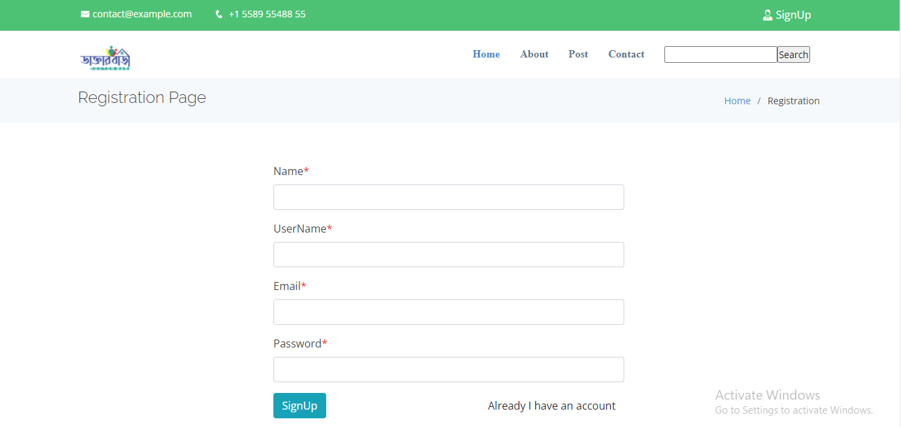
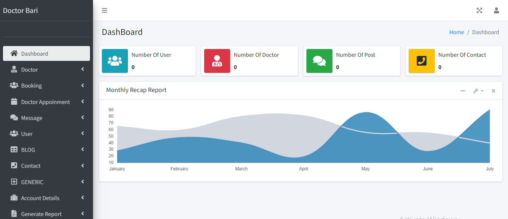
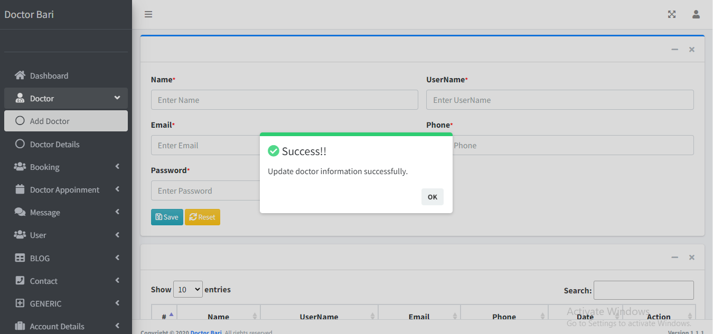
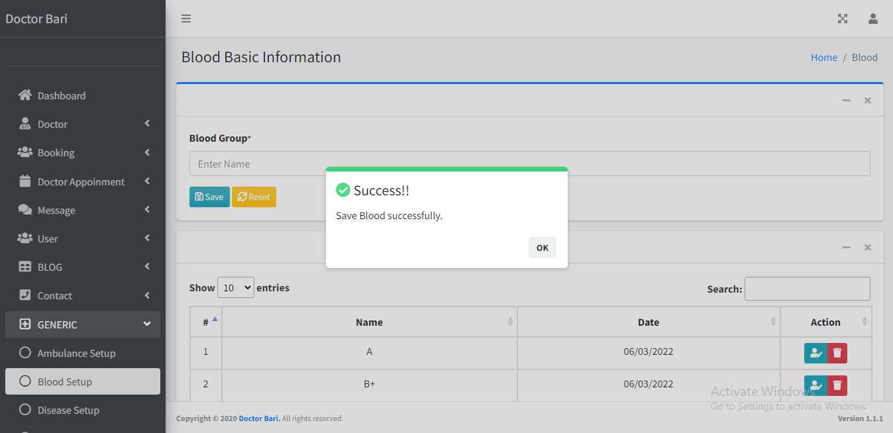
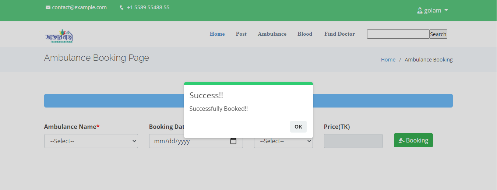
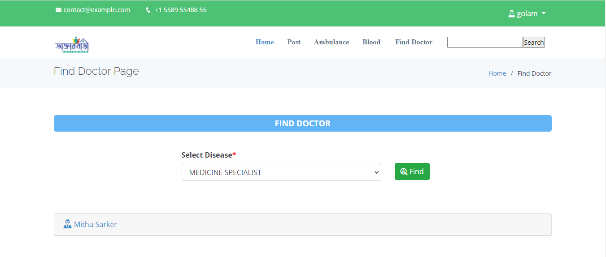
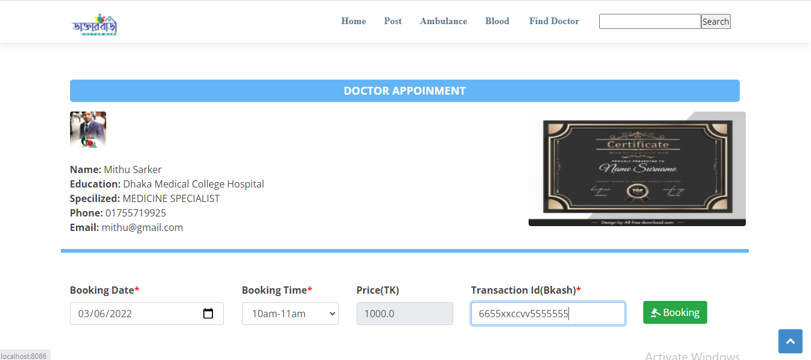
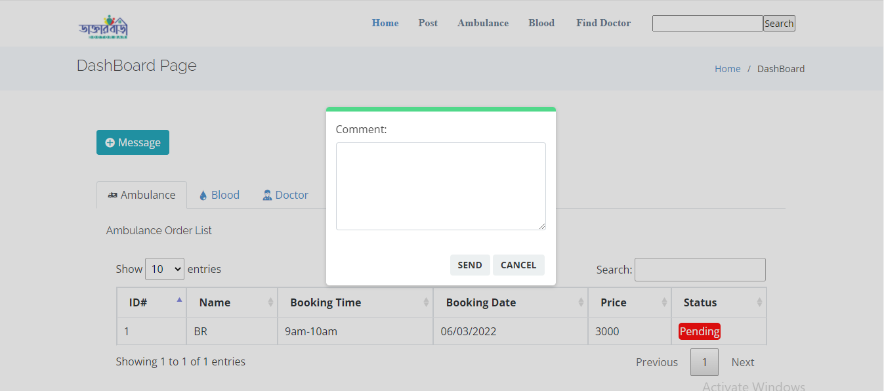
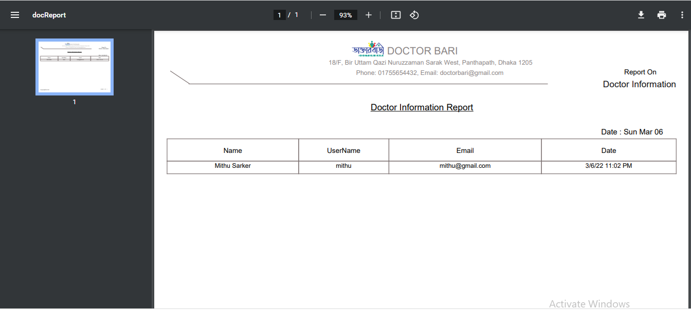

# Doctor-Bari
This project name is “Doctor-Bari”. This application is developed using Spring Boot, Jquery, JavaScript, Mysql,JasperReports and Theamleaf template engine.The main purpose of this application is find your nearest doctor.Using this application you can easily find out your nearest doctor,Diagnostic Centers.Each doctors will be evaluated by “Doctor-Bari” application so that only evaluated doctor will be here.There are three role system “Doctor-Bari” application admin,doctors and users.
<h3>Featurs</h3>
<h4>Users:</h4>
* login  
* Registration 
* Ambulance View/Booking 
* Doctor View/Appoinment 
* Blood View/Booking 
* Search Diagnostic center 
* View Profile 
* Update Profile 
* LogOut
<h4>Doctor:</h4>
* View Schedule List accept or reject  

<h4>Admin:</h4>
* Add Ambulance Name  
* Add Blood Name  
* Manage Doctor  
* Manage User  
* Mange Accounting  
* Generate Report  
* Manage User Security  
 

 

 

 

 

 

 

 

 

